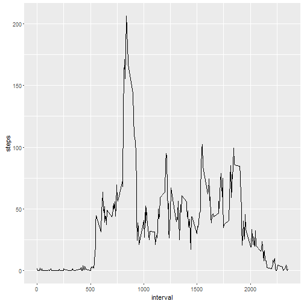

```r
---
title: "Reproducible Research Peer-graded Assignment: Course Project 1"
author: "Vaidyanatha Prasad"
date: "February 12, 2018"
output: html_document
---
```

```
## Error: <text>:7:0: unexpected end of input
## 5: output: html_document
## 6: ---
##   ^
```

```r
require(knitr)
## Attaching package: 'knitr'
knitr::opts_chunk$set(echo = TRUE)
require(dplyr)
## Attaching package: 'dplyr'
require(lubridate)
## Attaching package: 'lubridate'
require(ggplot2)
##  Attaching package: 'markdown'
require(markdown)
## Attaching package: 'ggplot2'
setwd("C:\\CourseraAssignments\\ReproducibleResearch\\Activity")
##Download the zip file from the 
## https://d396qusza40orc.cloudfront.net/repdata%2Fdata%2Factivity.zip
## Unzip the file and place it in the folder Activity 
Activitydata <- read.csv("activity.csv", header = TRUE, sep = ',', colClasses = c("numeric", "character","integer"))
Activitydata$date <- ymd(Activitydata$date)
##Using Dplyr to get the neccessary sub grouping and summarize the result 
steps <- Activitydata %>%
  filter(!is.na(steps)) %>%
  group_by(date) %>%
  summarize(steps = sum(steps)) %>%
  print
```

```
## # A tibble: 53 × 2
##          date steps
##        <date> <dbl>
## 1  2012-10-02   126
## 2  2012-10-03 11352
## 3  2012-10-04 12116
## 4  2012-10-05 13294
## 5  2012-10-06 15420
## 6  2012-10-07 11015
## 7  2012-10-09 12811
## 8  2012-10-10  9900
## 9  2012-10-11 10304
## 10 2012-10-12 17382
## # ... with 43 more rows
```

```r
##Histogram of the total number of steps taken each day
ggplot(steps, aes(x = steps)) +
  geom_histogram( binwidth = 1000) +
  labs(title = "Histogram of Steps per day", x = "Steps per day", y = "Frequency")
```


```r
##Mean and median number of steps taken each day
mean_steps <- mean(steps$steps, na.rm = TRUE)
median_steps <- median(steps$steps, na.rm = TRUE)
mean_steps
```

```
## [1] 10766.19
```

```r
median_steps
```

```
## [1] 10765
```

```r
##Time series plot of the average number of steps taken
interval <- Activitydata %>%
  filter(!is.na(steps)) %>%
  group_by(interval) %>%
  summarize(steps = mean(steps))
ggplot(interval, aes(x=interval, y=steps)) +
  geom_line(color = "black")
```



```r
##The 5-minute interval that, on average, contains the maximum number of steps
interval[which.max(interval$steps),]
```

```
## # A tibble: 1 × 2
##   interval    steps
##      <int>    <dbl>
## 1      835 206.1698
```

```r
##Code to describe and show a strategy for imputing missing data
data_full <- Activitydata
nas <- is.na(data_full$steps)
## Identify the mean/average for that day
## Create new dataset that is equal to the original dataset but with the missing data filled in
avg_interval <- tapply(data_full$steps, data_full$interval, mean, na.rm=TRUE, simplify=TRUE)
data_full$steps[nas] <- avg_interval[as.character(data_full$interval[nas])]
steps_full <- data_full %>%
  filter(!is.na(steps)) %>%
  group_by(date) %>%
  summarize(steps = sum(steps)) %>%
  print
```

```
## # A tibble: 61 × 2
##          date    steps
##        <date>    <dbl>
## 1  2012-10-01 10766.19
## 2  2012-10-02   126.00
## 3  2012-10-03 11352.00
## 4  2012-10-04 12116.00
## 5  2012-10-05 13294.00
## 6  2012-10-06 15420.00
## 7  2012-10-07 11015.00
## 8  2012-10-08 10766.19
## 9  2012-10-09 12811.00
## 10 2012-10-10  9900.00
## # ... with 51 more rows
```

```r
## Create histogram of the total number of steps taken each day and calculate and report the mean and median total number of steps taken per da
ggplot(steps_full, aes(x = steps)) +
  geom_histogram(fill = "black", binwidth = 1000) +
  labs(title = "Histogram of Steps per day, including missing values", x = "Steps per day", y = "Frequency")
```


```r
##Reporting Mean/Median
mean_steps_full <- mean(steps_full$steps, na.rm = TRUE)
median_steps_full <- median(steps_full$steps, na.rm = TRUE)

## Panel plot comparing the average number of steps taken per 5-minute interval across weekdays and weekends
data_full <- mutate(data_full, weektype = ifelse(weekdays(data_full$date) == "Saturday" | weekdays(data_full$date) == "Sunday", "weekend", "weekday"))
data_full$weektype <- as.factor(data_full$weektype)
head(data_full)
```

```
##       steps       date interval weektype
## 1 1.7169811 2012-10-01        0  weekday
## 2 0.3396226 2012-10-01        5  weekday
## 3 0.1320755 2012-10-01       10  weekday
## 4 0.1509434 2012-10-01       15  weekday
## 5 0.0754717 2012-10-01       20  weekday
## 6 2.0943396 2012-10-01       25  weekday
```

```r
interval_full <- data_full %>%
  group_by(interval, weektype) %>%
  summarise(steps = mean(steps))
##Make a panel plot containing a time series plot
s <- ggplot(interval_full, aes(x=interval, y=steps, color = weektype)) +
  geom_line() +
  facet_wrap(~weektype, ncol = 1, nrow=2)
print(s)
```


```
```

